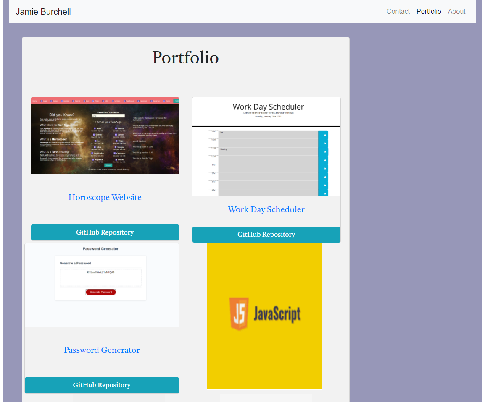

# Homework2_CSS_Bootstrap
Responsive Website with CSS and Bootstrap

This website has 3 parts the first about me is about my experience.  Next is the portfolio that contains work I have completed as well as techincal skills.  Lastly is the contact page where users may submit info to contact me.

Link to deployed site - https://burch531.github.io/Homework2_CSS_Bootstrap/

Link to GitHub - https://github.com/Burch531/Homework2_CSS_Bootstrap

## Technologies Used

HTML,
CSS,
Bootstrap,
Font Awesome,

## Screenshots

## Contact Info 
This page was built by myself Jamie Burchell

## License
MIT

